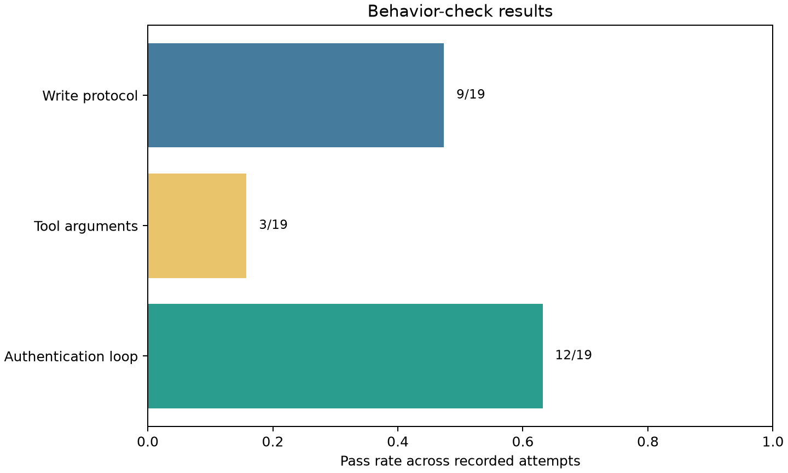

# Pipecat Voice + Tau-bench Retail

My goal was to build a small evaluation framework for 10 retail tasks in the Tau-bench retail domain. The system under test is a voice agent: a simulated customer and the retail agent speak to each other through Pipecat, while Tau-bench supplies the tasks, tools, policy, database state, and evaluation.

Tau-bench 2 also includes its own voice framework, but I intentionally used Pipecat for the voice front end and back end because the project specifically asks for a Pipecat voice agent. Pipecat handles the two-way conversation; Tau-bench handles the retail world.

This repository is a clean, reproducible release package. It contains the implementation, formal tests, a read-only Streamlit viewer, and the final `v4_calibrated_batch` evaluation bundle. Other local experiment runs, credentials, environments, caches, logs, and exploratory probe scripts are intentionally excluded.

## What is included

- **Two-way Pipecat voice agent:** separate customer and retail-agent pipelines, with speech moving in both directions.
- **Real-stack configuration:** MiniMax M2.7, NVIDIA Parakeet TDT 0.6B v3, Chatterbox, and Silero VAD.
- **Tau-bench retail integration:** environment state, tools, policy, task loading, local evaluation, and action checks.
- **Runtime guardrails:** grounded identifiers, serialized writes, duplicate-call protection, and immediate write confirmation checks.
- **Observability:** conversation-relative JSONL traces, canonical `SimulationRun` trajectories, agent/user audio, and generated audio segments.
- **Streamlit dashboard:** transcripts, reward breakdowns, trace timelines, audio playback, run comparison, seed display, and live artifact refresh.
- **Derived calibrated-batch report:** Markdown analysis, CSV tables, provenance manifest, and five charts in `reports/v4_calibrated_batch/`.

## Results at a glance

The `v4_calibrated_batch` was created after extensive iterative testing, debugging, and scaffolding work. It is not a first-pass run: the agent, transport, tool bridge, prompt policies, audio capture, evaluation checks, and viewer were all built and corrected against the earlier failures before this final bundle was assembled. The retained history includes the successful runs, failed runs, retries, and recovered artifacts that led to this condition.

The retained bundle contains **19 recorded attempts across 10 unique retail task IDs**. It is a mixed-provenance bundle, not a single clean 10-row split evaluation.

| Metric | Result |
|---|---:|
| Recorded attempts | 19 |
| Unique task IDs | 10 |
| Local reward `1.0` | 9/19 (47.4%) |
| DB match | 9/19 (47.4%) |
| Timeouts | 6/19 (31.6%) |
| All three behavior checks passed | 3/19 |
| Strict Tau2 reward | Unavailable for all 19 records |

### Selected task outcomes

| Task | Role | Attempts | Local successes | Representative outcome | Honest interpretation |
|---:|:---|---:|---:|---|---|
| 5 | selected test | 4 | 0 | `0.0`, DB mismatch, `0/5` actions | Clear failure. Three attempts timed out; the fourth failed authentication and did not complete the expected write. |
| 9 | selected test | 1 | 1 | `1.0`, DB match, `6/6` actions | Qualified local success. The local DB/action state passed, but `tool_argument_integrity` still failed because an authentication call returned `User not found`. |
| 12 | selected test | 1 | 1 | `1.0`, DB match, `4/5` actions | DB success, protocol failure. The agent used PayPal instead of the original payment method, so `write_protocol` failed. |

The raw `data/runs/v4_calibrated_batch/SUMMARY.md` is stale: it reports 14 rows while `summary.json` contains 19 result records. The derived report uses `summary.json` and explicitly documents the discrepancy. Task 2 is a recovered transcript without audio. Three additional simulation directories contain metadata only and are not counted as summary results.

Strict Tau2 reward was not scored because the harness used the local ENV, ACTION, and COMMUNICATE evaluators only. The `NL_ASSERTION` judge defaults to an OpenAI model and was unavailable in this run. A strict field of zero therefore means **strict reward unavailable**, not a scored zero-success rate.

### Visual report




See [`reports/v4_calibrated_batch/report.md`](reports/v4_calibrated_batch/report.md) for the full analysis, tables, charts, and caveats.

## Architecture

```text
Tau-bench retail task and user scenario
                    ↓
customer LLM → customer TTS → Pipecat voice pipeline → agent STT
     ↑                                                        ↓
customer STT ← agent TTS ← Pipecat voice pipeline ← retail agent LLM
                                                              ↓
                                                   grounded Tau-bench tools
                                                              ↓
                                                   retail database state
```

Pipecat is the voice front end and back end for the customer and retail-agent sides. The in-memory audio transport makes the experiment repeatable and keeps the two voices separate for recording and inspection. It is not a real microphone or network deployment.

Tau-bench 2 provides its own voice runtime, but this project deliberately uses Pipecat because the assignment asks for a Pipecat implementation. Tau-bench remains the source of the retail tasks, policy, tools, and state.

## Voice-system details

- **Two-way conversation:** the customer and agent run concurrently, with audio moving in both directions and interruption support.
- **VAD turn detection:** Silero is initialized at the pipeline sample rate and emits speech-start and speech-stop events, so small audio frames do not become separate customer turns.
- **Utterance-aware STT:** Parakeet receives accumulated audio and transcribes at end-of-speech or after a safe silence gap. This reduces broken names, zip codes, and tool arguments.
- **Continuous TTS:** Chatterbox synthesizes the complete agent response before it is forwarded to the customer side, reducing false turn boundaries caused by sentence pauses.
- **Hold and interruption behavior:** short checking phrases are treated as non-substantive, and the pipeline supports interruptions without adding the hold phrase to the scored context.
- **Audio evidence:** runs retain separate agent and customer audio, a mixed reference conversation, and per-turn metadata when exact capture is available.
- **Traceability:** VAD, STT, LLM, tool, TTS, lifecycle, and error events share a conversation-relative clock.

The main limitation is intentional: this is a repeatable in-memory voice environment, not a claim about microphone quality, echo cancellation, packet loss, or real-world barge-in.

## Requirements

- Python 3.12 or 3.13.
- `uv` or another Python package manager.
- A local or editable Tau-bench `1.0.1` installation with its data directory available.
- A MiniMax-compatible API key for real-stack runs.
- GPU and the `voice` optional dependencies for Parakeet and Chatterbox.
- An OpenAI-compatible key only if strict Tau2 NL assertions are enabled.

Tau-bench is an external dependency. The release does not vendor its checkout, data, virtual environment, or results. When Tau-bench is installed from a source checkout, set `TAU2_DATA_DIR` if its data is not found automatically.

## Installation

```bash
git clone <repository-url>
cd pipecat-voice-tau2-retail
uv venv --python 3.12
source .venv/bin/activate       # Windows PowerShell: .venv\Scripts\Activate.ps1

# Install the external Tau-bench checkout and this package.
git clone https://github.com/sierra-research/tau2-bench ../tau2-bench
uv pip install -e ../tau2-bench
uv pip install -e ".[dev,viewer]"
```

For the real voice stack, install the heavy optional dependencies:

```bash
uv pip install -e ".[voice,viewer,dev]"
```

For a lightweight offline smoke run, use dummy services and the core dependencies.

## Configuration

```bash
cp .env.example .env
```

Set a real key only in the untracked `.env` file:

```dotenv
MINIMAX_API_KEY=your-key
ANTHROPIC_API_KEY=your-anthropic-compatible-key
```

For an editable Tau-bench checkout whose data directory is elsewhere:

```dotenv
TAU2_DATA_DIR=/absolute/path/to/tau2-bench/data
```

The `.env.example` file is safe to commit; real `.env` files are ignored.

## Run

Offline smoke test:

```bash
python -m pipecat_voice.cli run --domain retail --task 0 \
  --stt dummy --tts dummy --agent-llm dummy --user-llm dummy
```

Real-stack single-task example:

```bash
python -m pipecat_voice.cli run --domain retail --task 1 \
  --num-trials 1 --max-seconds 360 --prompt-variant v4 \
  --agent-llm minimax --user-llm minimax \
  --stt parakeet --tts chatterbox --seed 42 \
  --out data/runs/v4_guard --write-summary --check all
```

The viewer is read-only and does not start evaluations:

```bash
streamlit run viewer/app.py
```

## Evaluation behavior checks

The harness runs deterministic offline checks after each simulation:

- `auth_loop`: repeated identical authentication calls or repeated requests for already supplied identity details.
- `tool_argument_integrity`: missing, unknown, malformed, or failed tool arguments and tool errors.
- `write_protocol`: multi-call writes, writes without immediate explicit confirmation, and missing required actions.

These checks are separate from Tau-bench's local reward and from the unavailable strict NL judge.

## Repository layout

```text
.
├── LICENSE
├── README.md
├── TECHNICAL_WRITEUP.md
├── pyproject.toml
├── .env.example
├── src/pipecat_voice/       # harness implementation
├── tests/                   # formal tests; exploratory probes excluded
├── viewer/                  # read-only Streamlit dashboard
├── data/runs/
│   └── v4_calibrated_batch/ # retained final evaluation bundle
└── reports/
    ├── build_calibrated_report.py
    └── v4_calibrated_batch/ # derived tables, charts, provenance, report
```

The raw evaluation directory is preserved as evidence. It contains synthetic Tau-bench task data, including benchmark names, addresses, example email addresses, order IDs, and payment-method IDs. It does not contain production customer records or real credentials.

## Sanity checks

From the repository root:

```bash
python -m ruff check src viewer tests reports
python -m compileall -q src viewer reports
python -m pytest -q
```

The full real-stack reproduction requires provider credentials, GPU-capable Parakeet/Chatterbox dependencies, and the Tau-bench data checkout. The offline smoke test does not require API keys.

## Technical notes

See [`TECHNICAL_WRITEUP.md`](TECHNICAL_WRITEUP.md) for the design, trade-offs, failure analysis, provenance limits, and future improvements. The calibrated-batch report is the authoritative derived analysis of the retained results.

## License

MIT. See [`LICENSE`](LICENSE).
