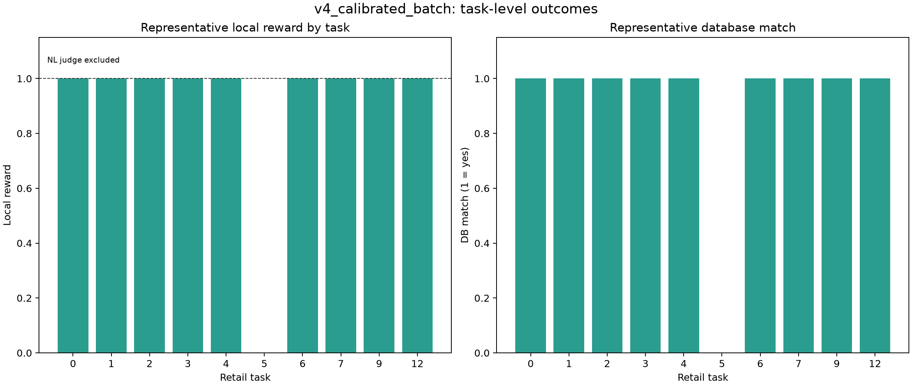
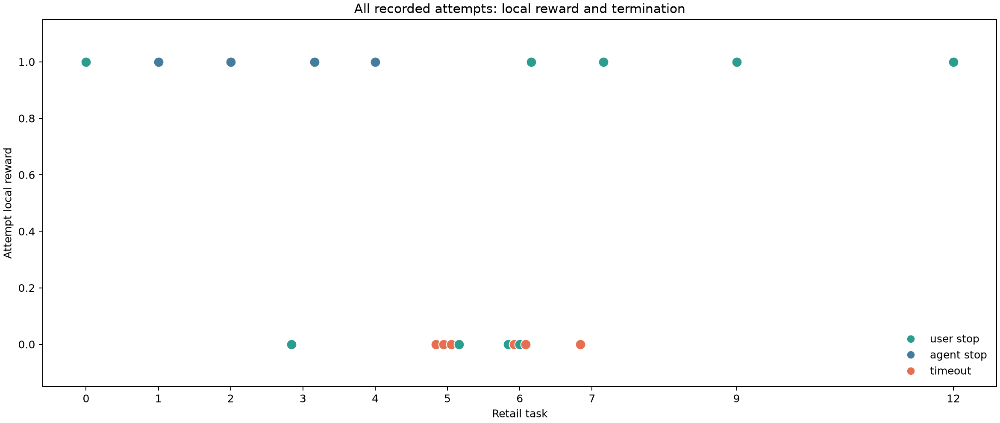
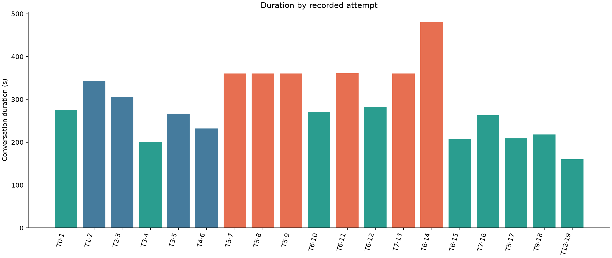
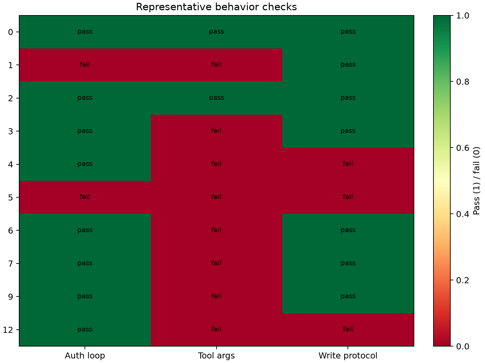

# Calibrated batch report

This report is derived from `data/runs/v4_calibrated_batch/summary.json` and its retained simulation artifacts. The raw summary, trajectories, traces, and audio are not modified.

## Executive summary

- **Recorded attempts:** 19 across 10 unique retail task IDs (10 unique in the raw record).
- **Local reward 1.0:** 9/19 recorded attempts (47.4%).
- **DB match:** 9/19 recorded attempts (47.4%).
- **Timeouts:** 6/19 recorded attempts (31.6%).
- **All three behavior checks passed:** 3/19 recorded attempts.
- **Strict Tau2 reward availability:** unavailable for all 19 records. The recorded strict field is 0 because the harness excluded the `NL_ASSERTION` dimension; the NL judge was not configured.

The local reward is a useful deterministic local score, not a substitute for full strict Tau2 reward. The strict evaluator requires an OpenAI NL judge (`gpt-4.1` in the harness), while this run used a MiniMax key and deliberately ran only local ENV, ACTION, and COMMUNICATE evaluators.

## Visual summaries










## Task-level view

A representative is selected for display by highest local reward, then DB match, then action fraction, then non-timeout termination. This is a display choice, not a replacement for the full attempt table.

| Task | Split | Attempts | Local 1.0 attempts | DB match attempts | Representative | Local | DB | Actions | Termination | Auth | Args | Write |
|---:|:---:|---:|---:|---:|:---|---:|:---:|:---:|:---:|:---:|:---:|:---:|
| 0 | train | 1 | 1 | 1 | `sim_32b46f41` | 1.0 | True | 5/5 | user_stop | pass | pass | pass |
| 1 | train | 1 | 1 | 1 | `sim_b9613563` | 1.0 | True | 5/5 | agent_stop | fail | fail | pass |
| 2 | train | 1 | 1 | 1 | `sim_recovered_2` | 1.0 | True | 10/11 | agent_stop | pass | pass | pass |
| 3 | train | 2 | 1 | 1 | `sim_ef4acc02` | 1.0 | True | 10/12 | agent_stop | pass | fail | pass |
| 4 | train | 1 | 1 | 1 | `sim_648ee76c` | 1.0 | True | 13/13 | agent_stop | pass | fail | fail |
| 5 | test | 4 | 0 | 0 | `sim_242bc74e` | 0.0 | False | 0/5 | user_stop | fail | fail | fail |
| 6 | train | 5 | 1 | 1 | `sim_adabd789` | 1.0 | True | 6/6 | user_stop | pass | fail | pass |
| 7 | train | 2 | 1 | 1 | `sim_27c7509b` | 1.0 | True | 6/6 | user_stop | pass | fail | pass |
| 9 | test | 1 | 1 | 1 | `sim_f169fffe` | 1.0 | True | 6/6 | user_stop | pass | fail | pass |
| 12 | test | 1 | 1 | 1 | `sim_a7f41d66` | 1.0 | True | 4/5 | user_stop | pass | fail | fail |

## Honest interpretation

- **Task 5 is the clear test-task failure.** The bundle contains four recorded task-5 attempts, all with local reward 0.0. Three timed out, and the non-timeout attempt ended with a failed authentication path and no successful expected write. It is not a successful task under any local metric. Task 5 is also inside the earlier 0-7 development slice, so it is not a clean held-out task boundary despite its final test-set designation.
- **Task 9 is a qualified local success.** Its representative attempt has local reward 1.0, DB match, and 6/6 actions. Its `tool_argument_integrity` check still fails because a recorded authentication call returned `User not found`; therefore the local reward should not be read as a clean behavior-check pass.
- **Task 12 is a DB success but a protocol failure.** Its representative attempt has local reward 1.0, DB match, and 4/5 actions, but the write fails because PayPal was used instead of the order's original payment method. The `write_protocol` check correctly fails.
- **Training-task outcomes are mixed across attempts.** The bundle contains successful local representatives for training tasks 0, 1, 2, 3, 4, 6, and 7, but several representatives still fail one or more behavior checks. Task 3 and task 6 contain both successful and unsuccessful attempts, so selecting a success without showing the attempt count would overstate stability.
- **The bundle is mixed provenance.** The root config declares `split=test`, while the bundle includes training task IDs 0-7 and the selected test IDs 5, 9, and 12. Task 5 is therefore present in both the 0-7 development slice and the reported test set, as the user’s final selection specifies. The raw `SUMMARY.md` is stale at 14 rows; `summary.json` is the authoritative 19-record source for this report. Task 2 is a recovered transcript without audio, and three metadata-only simulation directories are retained for completeness.
- **No infrastructure error was recorded** for the 19 summary records, but strict NL scoring was not attempted. The report separates local outcome, DB/action checks, and strict-reward availability.

## Reproduce the derived report

```powershell
python reports/build_calibrated_report.py .\data\runs\v4_calibrated_batch .\reports\v4_calibrated_batch
```

The command above only reads raw artifacts and rewrites derived tables/charts under `reports/v4_calibrated_batch/`.
